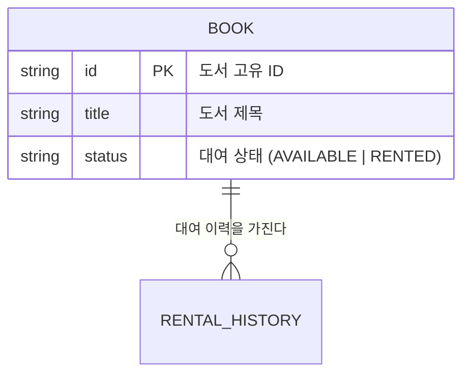

# Book 도메인 명세

> **참고 규칙**: `docs/rules/DOMAIN_RULE.md`
> **아키텍처 흐름**: `docs/PATTERN.md`

이 문서는 Book 도메인의 관계도 및 핵심 구성 요소에 대한 명세입니다.

---

## 📁 디렉토리 구조

```
src/domain/
├── models/
│   └── book.model.ts               # Entity (Domain Model)
├── repositories/
│   └── book.repository.interface.ts  # Repository Interface (Port)
└── exceptions/
    └── book.exception.ts           # Domain Exception
```

---

## 0. 도메인 모델 관계도 (Relationships)

### 📊 관계 다이어그램


### 📋 관계 상세 설명
| 소스 도메인 | 타겟 도메인 | 관계 유형 | 설명 |
|---|---|---|---|
| `Book` | `RentalHistory` | `1:N` | 한 권의 도서는 여러 번의 대여 이력을 가질 수 있음 |

---

## 1. Entity (Domain Model) 템플릿

```typescript
// src/domain/models/book.model.ts
import { BookDomainException } from '../exceptions/book.exception';

export enum BookStatus {
  AVAILABLE = 'AVAILABLE',
  RENTED = 'RENTED',
}

export class Book {
  private title: string;
  private status: BookStatus;

  constructor(
    public readonly id: string,
    title: string,
    status: BookStatus = BookStatus.AVAILABLE,
  ) {
    this.title = title;
    this.status = status;
  }

  // ✅ 비즈니스 의미를 드러내는 메서드명 사용
  updateTitle(newTitle: string): void {
    if (!newTitle || newTitle.trim().length === 0) {
      throw new BookDomainException('도서 제목은 빈 값일 수 없습니다.');
    }
    this.title = newTitle;
  }

  rent(): void {
    if (this.status !== BookStatus.AVAILABLE) {
      throw new BookDomainException('이미 대여 중인 도서입니다.');
    }
    this.status = BookStatus.RENTED;
  }

  return(): void {
    if (this.status !== BookStatus.RENTED) {
      throw new BookDomainException('이미 반납된 도서입니다.');
    }
    this.status = BookStatus.AVAILABLE;
  }

  // Getter (상태 노출용)
  getTitle(): string { return this.title; }
  getStatus(): BookStatus { return this.status; }
}
```

---

## 3. Repository Interface (Port) 템플릿

```typescript
// src/domain/repositories/book.repository.interface.ts
import { BookInfraDto } from '../../infrastructure/dtos/book.infra-dto';
import { Book } from '../models/book.model';
import { TransactionContext } from '../types/transaction.type';

export interface BookRepository {
  findById(id: string, tx?: TransactionContext): Promise<BookInfraDto | null>;
  findAll(tx?: TransactionContext): Promise<BookInfraDto[]>;
  save(book: Book, tx?: TransactionContext): Promise<BookInfraDto>;
  delete(id: string, tx?: TransactionContext): Promise<void>;
}
```

---

## 4. Domain Exception 템플릿

```typescript
// src/domain/exceptions/book.exception.ts
export class BookDomainException extends Error {
  constructor(message: string) {
    super(message);
    this.name = 'BookDomainException';
  }
}
```

---

## ⚠️ 금지 패턴 체크리스트

| 항목 | 확인 |
|------|------|
| Domain Model에 ORM(Prisma, TypeORM) import가 없는가? | ✅ |
| Domain Model에 Framework(Express, NestJS) 의존성이 없는가? | ✅ |
| 상태 변경이 반드시 내부 메서드를 통해서만 이루어지는가? | ✅ |
| setter가 없고 비즈니스 의미 있는 메서드명을 사용하는가? | ✅ |
| 비즈니스 규칙 위반 시 Domain Exception을 발생시키는가? | ✅ |
| Repository Interface 반환 타입이 Infra DTO인가? | ✅ |
