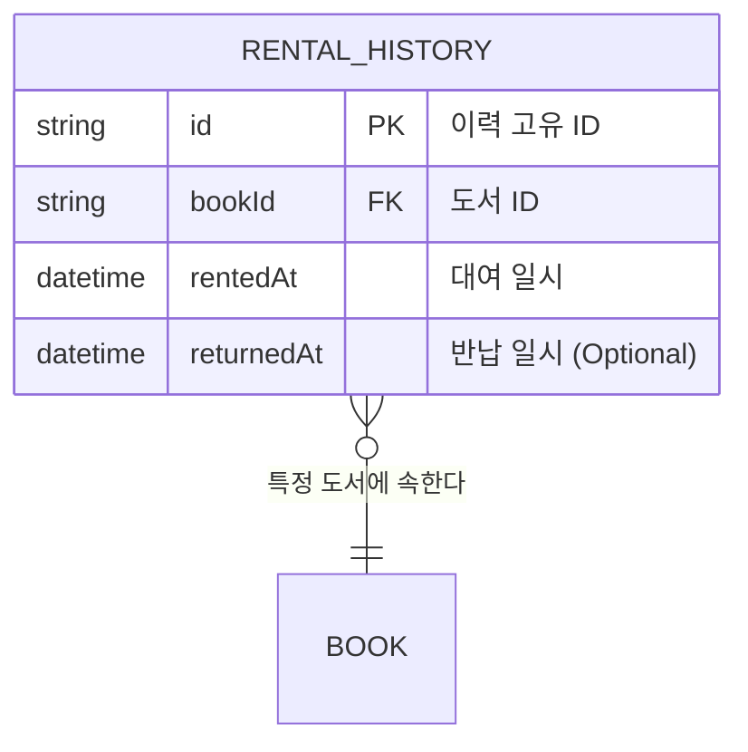

# Rental 도메인 명세

> **참고 규칙**: `docs/rules/DOMAIN_RULE.md`
> **아키텍처 흐름**: `docs/PATTERN.md`

이 문서는 Rental 도메인의 관계도 및 핵심 구성 요소에 대한 명세입니다.

---

## 📁 디렉토리 구조

```
src/domain/
├── models/
│   └── rental-history.model.ts      # Entity (Domain Model)
├── repositories/
│   └── rental-history.repository.interface.ts # Repository Interface (Port)
└── exceptions/
    └── rental.exception.ts         # Domain Exception
```

---

## 0. 도메인 모델 관계도 (Relationships)

### 📊 관계 다이어그램


### 📋 관계 상세 설명
| 소스 도메인 | 타겟 도메인 | 관계 유형 | 설명 |
|---|---|---|---|
| `RentalHistory` | `Book` | `N:1` | 여러 대여 이력은 하나의 도서에 연결됨 |

---

## 1. Entity (Domain Model) 템플릿

```typescript
// src/domain/models/rental-history.model.ts
import { RentalDomainException } from '../exceptions/rental.exception';

export class RentalHistory {
  private returnedAt: Date | null;

  constructor(
    public readonly id: string,
    public readonly bookId: string,
    public readonly rentedAt: Date,
    returnedAt: Date | null = null,
  ) {
    this.returnedAt = returnedAt;
  }

  // ✅ 비즈니스 의미를 드러내는 메서드명 사용
  completeReturn(returnDate: Date): void {
    if (this.returnedAt) {
      throw new RentalDomainException('이미 반납 처리가 완료된 이력입니다.');
    }
    if (returnDate < this.rentedAt) {
      throw new RentalDomainException('반납일은 대여일보다 빠를 수 없습니다.');
    }
    this.returnedAt = returnDate;
  }

  // Getter (상태 노출용)
  getReturnedAt(): Date | null { return this.returnedAt; }
}
```

---

## 3. Repository Interface (Port) 템플릿

```typescript
// src/domain/repositories/rental-history.repository.interface.ts
import { RentalHistoryInfraDto } from '../../infrastructure/dtos/rental-history.infra-dto';
import { RentalHistory } from '../models/rental-history.model';
import { TransactionContext } from '../types/transaction.type';

export interface RentalHistoryRepository {
  findByBookId(bookId: string, tx?: TransactionContext): Promise<RentalHistoryInfraDto[]>;
  findLatestByBookId(bookId: string, tx?: TransactionContext): Promise<RentalHistoryInfraDto | null>;
  save(history: RentalHistory, tx?: TransactionContext): Promise<RentalHistoryInfraDto>;
}
```

---

## 4. Domain Exception 템플릿

```typescript
// src/domain/exceptions/rental.exception.ts
export class RentalDomainException extends Error {
  constructor(message: string) {
    super(message);
    this.name = 'RentalDomainException';
  }
}
```

---

## ⚠️ 금지 패턴 체크리스트

| 항목 | 확인 |
|------|------|
| Domain Model에 ORM(Prisma, TypeORM) import가 없는가? | ✅ |
| Domain Model에 Framework(Express, NestJS) 의존성이 없는가? | ✅ |
| 상태 변경이 반드시 내부 메서드를 통해서만 이루어지는가? | ✅ |
| setter가 없고 비즈니스 의미 있는 메서드명을 사용하는가? | ✅ |
| 비즈니스 규칙 위반 시 Domain Exception을 발생시키는가? | ✅ |
| Repository Interface 반환 타입이 Infra DTO인가? | ✅ |
